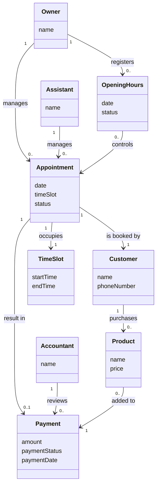
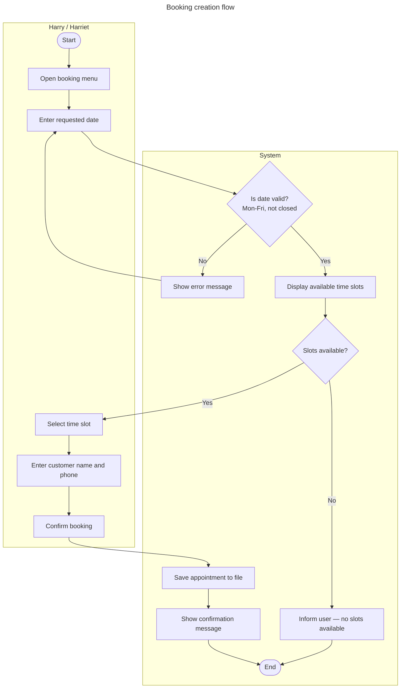

# 🗓️ Harry's Salon — 2-Week Project Gameplan

> **Case:** Harry's Salon (Projekt B — DAT-F26B) **Submission:** Friday 27/03 kl. 15:45 — ItsLearning **Presentation prep:** Tuesday 07/04 **Presentation:** Wednesday 08/04 **Repo:** `github.com/[your-repo-link]` **Board:** Trello — `[your-board-link]`

> **Legend:** ✅ Explicitly required by the assignment ⭐ Course enrichment (ITB/SD1 curriculum — strengthens the presentation but not a submission requirement)

---

## Role Rotation

||PO|SM (Mon–Wed)|SM (Thu–Fri)|
|---|---|---|---|
|**Sprint 1**|Member A|Member B|Member C|
|**Sprint 2**|Member B|Member C|Member A|

> All members are Developers throughout both sprints. GitHub-responsible follows the SM role each half-week. See: [[Roles vs Persons & RACI]], [[Scrum]]

---

## 📦 Deliverables Checklist

> Two PDFs must be placed in the **GitHub repo root** as well as uploaded to ItsLearning. The cover page goes in the ItsLearning upload document.

### Cover Page (ItsLearning upload) ✅

- [ ] Group number and name
- [ ] GitHub repository link — **both clickable and written out in plain text** (so it can be printed and typed)
- [ ] Full names of all group members + their GitHub usernames

### ITB — `ITB_presentation.pdf` in GitHub root ✅

- [ ] ✅ Interessentanalyse — stakeholder analysis (required for both the PDF and the presentation)
- [ ] ✅ Risikoanalyse — risk analysis table (K×S scores)
- [ ] ✅ Risikoplan — risk plan (mitigations + actions for top risks)
- [ ] ⭐ Mission & Vision — _recommended to frame the presentation, not a submission requirement_
- [ ] ⭐ SWOT — _good context slide, not required_
- [ ] ⭐ RACI table (Harry / Harriet / Revisor) — _shows ITB depth, not required_
- [ ] ⭐ WSJF prioritisation rationale — _shows ITB depth, not required_

### SYS — `SYS_rapport.pdf` in GitHub root ✅

- [ ] ✅ Requirements listed as [[FURPS+]] **OR** Functional/Non-Functional _(pick one format, not both)_
- [ ] ✅ [[User Stories]] for all implemented stories — format: `As a [role], I can [activity], so that [goal]`
- [ ] ✅ [[Acceptance Criteria]] for each implemented story — format: "how to demo/test"
- [ ] ✅ Screenshot: Product Backlog (Trello) — take **before** Sprint 1 starts
- [ ] ✅ Screenshot: Sprint 1 Backlog (Trello) — taken during/at end of Sprint 1
- [ ] ✅ Screenshot: Sprint 2 Backlog (Trello) — taken during/at end of Sprint 2
- [ ] ✅ [[Activity Diagrams]] — user interaction with the system _(at minimum one comprehensive diagram; multiple flows recommended)_
- [ ] ✅ [[Domain Model]] — conceptual model (no methods, no types)
- [ ] ✅ [[UML Class Diagrams]] — class diagram of the **finished** system
- [ ] ⭐ [[Use Cases]] — _good analysis artefact, not explicitly required in the rapport_
- [ ] ⭐ [[GRASP]] evaluation — _strengthens class diagram discussion, not required_

### PRG — Code on public GitHub repo ✅

- [ ] ✅ Code compiles and runs — testable product after each sprint
- [ ] ✅ OOP design: [[Encapsulation]], [[Abstraction]], [[Inheritance]], [[Polymorphism]]
- [ ] ✅ Java naming conventions throughout
- [ ] ✅ [[Enums]] — used for structured constant values (e.g. appointment status)
- [ ] ✅ [[Exception Handling]] — `try/catch` so program never crashes on bad input
- [ ] ✅ Input validation — check and handle wrong/invalid user input
- [ ] ✅ [[ArrayList]] — store and manipulate collections of data
- [ ] ✅ `Array` — used **alongside** ArrayList where appropriate _(both must appear in the code)_
- [ ] ✅ [[File IO]] — read and write data to files (save on change, reload on startup)
- [ ] ✅ [[Packages]] — code split into packages with clear responsibilities
- [ ] ✅ Sorting — data sorted on multiple properties (e.g. date, name, amount)
- [ ] ✅ [[Static vs Instance]] — static classes/methods for helpers (validation, sorting, file handling)
- [ ] ✅ JavaDoc comments on all classes and public methods
- [ ] ⭐ [[Custom Exceptions]] — _shows depth, not explicitly required_
- [ ] ⭐ [[Comparable]] / [[Comparator]] — _required for sorting, implicit requirement_

---

---

# SPRINT 1 — Week 1 (16/03–20/03)

> **Sprint Goal:** Working core booking flow, file persistence in place, all key SYS artefacts drafted. **Scrum events:** Planning (Mon AM) · Daily Scrum (every day, 15 min) · Review + Retro (Fri PM)

---

## Monday 16/03 — Sprint Planning + ITB Day

> 🎯 ITF: 1 day | PO = A leads planning, SM = B facilitates

### Morning — Projektopstart + Sprint Planning

_Timebox: 2–3 hours. Output: feature list, initial user stories, filled Sprint 1 Backlog in Trello._

> ⚠️ The assignment explicitly says to start here — feature list first, user stories second.

- [x] **All: Feature list** ✅ — bullet point every feature Harry wants from the case description
    - Go through the case text line by line, extract each thing the system must do
    - Keep it plain language, no story format yet — just "create booking", "view sorted list", etc.
    - This list becomes the input to your Product Backlog
- [x] **All: Write User Stories** ✅ from the feature list
    - Format: `As a [role], I can [activity], so that [goal]`
    - Three roles: Harry, Harriet, Revisor
    - Check each story against [[INVEST]] before adding to Trello
    - Write [[Acceptance Criteria]] ("how to demo") for each story immediately
- [x] **PO (A):** Load stories into Trello Product Backlog, confirm Sprint 1 vs Sprint 2 scope
- [x] **Team:** Estimate each story in Story Points (1/3/5/8)
- [x] **SM (B):** Confirm [[Definition of Done]] is posted in Trello
- [x] **All:** Agree Sprint Goal, write it at the top of the board
- [x] 📸 Screenshot Product Backlog **now, before moving anything** → `sprint1_product_backlog.png`

**Sprint 1 Story Targets (suggested — adjust after estimation):**

1. Create booking (core)
2. View upcoming appointments sorted by date/time
3. Delete booking
4. File persistence — save on every change, reload on startup _(high risk if left to Sprint 2)_
5. Register payment for completed appointment

### Afternoon — ITB Work

_Output: ITB PowerPoint slides drafted._

- [x] **Interessentanalyse** ✅ → [[Power-Interest Matrix & Engagement]], [[Stakeholder Analysis]]
    - Harry: High Power / High Interest → Manage Closely (Quadrant II)
    - Harriet: Low Power / High Interest → Keep Informed (Quadrant IV)
    - Revisor: High Power / Low Interest → Keep Satisfied (Quadrant I)
    - Note: Harriet functions as a [[Gatekeeper]] in practice — UI confusion here blocks Harry's value
- [x] ⭐ **Mission & Vision** → [[Mission & Vision Statements]] _(recommended context slide)_
    - Mission: what Harry's Salon does today
    - Vision: measurable 2–4 year target ("ingen papirkalender inden 2028")
- [x] ⭐ **SWOT** → [[SWOT Analysis]] _(recommended context slide)_
    - S/W = internal | O/T = external
- [ ] ⭐ **RACI table** → [[RACI Framework]] _(shows ITB depth — who does what across the three roles)_

---

## Tuesday 17/03 — SYS Day 1

> 🎯 SYS: day 1 of 2 | SM = B

### All Day — Requirements + Domain Model

- [x] **[[FURPS+]] requirements** ✅ — write the full requirements section for the SYS rapport
    - Decide now: FURPS(+) _or_ Functional/Non-Functional _(the assignment says OR — pick one and be consistent)_
    - Functional: create booking, delete booking, view sorted list, register payment, revisor lookup, file persistence
    - Non-functional examples:
        - Usability: role-appropriate menus, not overwhelming
        - Reliability: no data loss — save on every write
        - Security: password for financial access (nice-to-have)
        - Constraints: console-based, single-user, Java, no network
- [ ] **[[User Stories]] + [[Acceptance Criteria]]** ✅ — finalise all Sprint 1 stories
    - Each story: one clear role, one clear activity, one clear goal
    - Each acceptance criterion phrased as "how to demo/test" — concrete and verifiable
    - Check [[INVEST]] for each: Independent? Valuable? Estimable? Small? Testable?
- [x] **[[Domain Model]]** ✅ — draw the conceptual model
    - Concepts (suggested): `Appointment`, `Customer`, `TimeSlot`, `Payment`, `ClosedDay`
    - Show associations with verb labels and multiplicity
    - NO methods, NO data types — this is a conceptual model, not a class diagram
    - Tool: draw.io or paper → export → `sysdev/diagrams/domain-model.png`



- [ ] ⭐ **[[Use Cases]]** — use case diagram with three actors (Harry, Harriet, Revisor)
    - Include system boundary
    - Not required in the rapport but useful for your own analysis and the presentation
    - Export → `sysdev/diagrams/use-case-diagram.png`

---

## Wednesday 18/03 — SYS Day 2

> 🎯 SYS: day 2 of 2 | SM switches to C

### All Day — Activity Diagram + Initial Class Design

- [ ] **[[Activity Diagrams]]** ✅ — model user interaction with the system
    - The assignment requires this — show how users actually move through the system
    - Suggested: one comprehensive diagram covering the main booking flow with decision points, OR separate diagrams per major flow using [[Swimlanes]]
    - Flows to cover:
        1. Booking creation (Harriet/Harry → date input → slot check → confirm → save to file)
        2. Payment registration
        3. Revisor lookup (date input → fetch appointments → sort → display)
    - Export → `sysdev/diagrams/activity-diagram.png`

- [ ] **Package structure decision** ✅ — agree this now before anyone writes code
    
    ```
    model/   → Appointment, Customer, Payment, AppointmentStatus (enum)data/    → AppointmentRepository (all file read/write lives here)ui/      → HarryMenu, HarrietMenu, RevisorMenu, Mainutil/    → InputValidator (static), SortUtils (static — Comparators)
    ```
    
    Reference: [[Packages]], [[Static vs Instance]]
- [ ] **Initial [[UML Class Diagrams|Class Diagram]] sketch** — not the final version, just a design plan
    - Translate Domain Model: add visibility (`+`/`-`), data types, method signatures
    - Add `AppointmentStatus` enum
    - ⭐ Apply [[GRASP]] checks informally:
        - One responsibility per class? → [[High Cohesion]]
        - Not too many dependencies? → [[Low Coupling]]
        - `if/else` on type anywhere? → candidate for [[Polymorphism]]

---

## Thursday 19/03 — PRG Day 1

> 🎯 PRG: day 1 of 2 | SM = C

### Setup

- [x] Create GitHub repo (public) → push initial project with package folders
- [x] Everyone clones, confirms they can push to `master`
- [x] Add `sysdev/` and `itb/` folders to repo root with empty READMEs

### Code Targets

- [ ] `model/Appointment.java` — fields, constructor, getters, `toString()`, `equals()`
    - Reference: [[Encapsulation]], [[Constructor Overloading]], [[toString Method]], [[equals Method]]
- [ ] `model/Customer.java` — name, phone number
- [ ] `model/AppointmentStatus.java` — enum: `BOOKED`, `COMPLETED`, `PAID`, `CREDIT`
    - Reference: [[Enums]] ✅ required by assignment
- [ ] `model/` — decide where an `Array` fits naturally ✅ _(assignment requires both Array and ArrayList)_
    - Suggestion: store the salon's fixed time slots as a `String[]` array (10:00, 11:00 … 17:00)
    - Appointments themselves stored in `ArrayList<Appointment>` in the repository
- [ ] `data/AppointmentRepository.java` — `ArrayList<Appointment>` in memory, stub `saveToFile()` / `loadFromFile()`
    - Reference: [[ArrayList]], [[Static vs Instance]]
- [ ] `ui/HarrietMenu.java` — create booking (console input, slot validation)
    - Reference: [[Scanner Class]], [[Conditionals]], [[Exception Handling]] ✅
- [ ] `util/InputValidator.java` — static methods: `validateDate()`, `validateTime()`
    - Reference: [[Static vs Instance]] ✅, [[Exception Handling]] ✅
- [ ] **Manual test:** create a booking → print to console → confirm all fields correct
- [ ] Commit: `Add Appointment model, enum, and HarrietMenu booking creation`

---

## Friday 20/03 — PRG Day 2 + Sprint 1 Review & Retro

> 🎯 PRG: day 2 of 2 + Scrum ceremonies | SM = C

### Morning — PRG

- [ ] `data/AppointmentRepository.java` — implement `saveToFile()` and `loadFromFile()` ✅
    - CSV format: one appointment per line, comma-separated fields
    - Save is called every time an appointment is created, updated, or deleted
    - Reference: [[File IO]] ✅, [[CSV Format]], [[Exception Handling]] ✅, [[Checked vs Unchecked Exceptions]]
- [ ] `ui/HarryMenu.java` — view sorted appointment list + mark appointment as completed
    - Natural sort by date then time → implement [[Comparable]] on `Appointment`
    - Reference: [[Comparable]], [[Sorting]] ✅, [[Collections Class]]
- [ ] `ui/HarrietMenu.java` — add delete booking
    - Reference: [[Exception Handling]] ✅ (handle case where booking ID doesn't exist)
- [ ] **Integration test:** create booking → close program → reopen → confirm data reloaded ✅
- [ ] Commit: `Add file persistence and sorted appointment view`
- [ ] 📸 Screenshot Sprint 1 Trello board **before the Review** → `sprint1_sprint_backlog.png`

### Afternoon — Sprint 1 Review + Retrospective

_Reference: [[Sprint Review]], [[Sprint Retrospective]], [[Sprint Rituals]]_

**Review (30 min) — demo the working increment:** ✅ _Assignment: testable product after each sprint_

- [ ] Demo: create booking → view sorted list → delete booking → register payment → restart → data reloads
- [ ] Check [[Acceptance Criteria]] for each Sprint 1 story — mark each as passed or failed
- [ ] Failed stories → move back to Product Backlog for Sprint 2

**Retrospective (20 min) — Start/Stop/Continue:**

- [ ] What went well?
- [ ] What to change for Sprint 2?
- [ ] Explicitly note: unit testing not yet in scope → add to "Start" for documented awareness
- [ ] Update [[Definition of Done]] if needed → [[Risk Log & Monitoring]]

---

---

# SPRINT 2 — Week 2 (23/03–27/03)

> **Sprint Goal:** Revisor view complete, sorting working, all required documentation finalised, submission ready. **Hard deadline:** Friday 27/03 kl. 15:45 **Scrum events:** Planning (Mon AM) · Daily Scrum (every day) · Review + Retro (**Thursday** PM — protects Friday)

---

## Monday 23/03 — Sprint Planning + ITB Finish

> 🎯 ITF: 0.5 day | PO = B, SM = C

### Morning — Sprint 2 Planning

_Timebox: 1.5 hours. Output: Sprint 2 Backlog in Trello._

- [ ] **PO (B):** Review what carried over from Sprint 1, re-estimate
- [ ] Nice-to-haves enter Sprint 2 backlog only **after** all core stories are accounted for
    - Priority order: Revisor lookup → Sort by name/amount → Password (nice-to-have) → Closed day registration → 5-day availability → Product add-ons
- [ ] 📸 Screenshot Product Backlog at Sprint 2 start → `sprint2_product_backlog.png`
- [ ] Set Sprint Goal for Sprint 2 — write it on the board

### Afternoon — ITB Finalisation ✅

- [ ] **Risikoanalyse** ✅ → [[Risk Management Framework]]
    - Score ≥5 risks using K×S (1–25 scale)
    - 1–5: Accept | 6–12: Mitigate | 15–25: Escalate
    - Update scores based on Sprint 1 — did any EWIs trigger? → [[Risk Log & Monitoring]]
- [ ] **Risikoplan** ✅ → [[Risk Log & Monitoring]]
    - Top 3 risks: mitigation action, owner, EWI (Early Warning Indicator)
- [ ] ⭐ **WSJF rationale slide** → [[Backlog Prioritization (WSJF)]] _(shows how priorities were decided)_
- [ ] **ITB PowerPoint: final assembly**
    - ✅ Required slides: Interessentanalyse · Risikoanalyse · Risikoplan
    - ⭐ Recommended: Mission & Vision · SWOT · RACI · WSJF overview
- [ ] Export as PDF → `ITB_presentation.pdf` → push to GitHub repo root

---

## Tuesday 24/03 — SYS Finish

> 🎯 SYS: today + Wednesday AM | SM = C

### All Day — Final Class Diagram + Rapport Assembly

- [ ] **Final [[UML Class Diagrams|Class Diagram]]** ✅ — drawn from the **actual implemented code**, not the design sketch
    - Every class that exists in the code must appear
    - Visibility symbols on all attributes (`-`) and methods (`+`)
    - Relationships with correct notation (association, aggregation, inheritance etc.)
    - Data types in UML syntax (`- name : Type`, not Java syntax)
    - Abstract classes in _italics_ if any
    - Export → `sysdev/diagrams/class-diagram.png`
    - ⭐ Evaluate against [[GRASP]]: [[Low Coupling]], [[High Cohesion]], [[Polymorphism]]
- [ ] ⭐ **Design patterns note** → `sysdev/design-patterns/` _(optional but good for presentation)_
    - `strategy-comparator.md` — `Comparator` classes as Strategy pattern
    - `facade.md` — `BookingService` / repository layer hiding file logic
- [ ] **SYS rapport content — finalise all sections:**
    - [ ] [[FURPS+]] requirements (final version) ✅
    - [ ] All [[User Stories]] with [[Acceptance Criteria]] for every implemented story ✅
    - [ ] All Trello screenshots collected ✅
    - [ ] [[Activity Diagrams]] exported and labelled ✅
    - [ ] [[Domain Model]] exported ✅
    - [ ] Class diagram exported ✅

---

## Wednesday 25/03 — PRG Day 1 (Sprint 2)

> 🎯 PRG: day 1 of 3 | SM switches to A

### All Day — Revisor Feature + Sorting

- [ ] `ui/RevisorMenu.java` — lookup appointments by a past date, display formatted list ✅
    - Validate date input (must be before today) → [[Exception Handling]] ✅
    - Reference: [[Scanner Class]], [[Conditionals]]
- [ ] `util/SortUtils.java` — two sorting options for the Revisor view ✅
    - `SortByCustomerName` — alphabetical → [[Comparator]]
    - `SortByPaymentAmount` — descending by amount → [[Comparator]]
    - Reference: [[Comparator]], [[Sorting]] ✅, [[Collections Class]], [[Interface]]
    - Both are [[Static vs Instance|static]] factory methods returning a `Comparator` ✅
- [ ] Wire sort choice into `RevisorMenu` — user selects sort order from a numbered menu
- [ ] **Fill any Sprint 1 gaps before adding nice-to-haves**
- [ ] Commit: `Add RevisorMenu with date lookup and sortable results`

---

## Thursday 26/03 — PRG Day 2 + Sprint 2 Review & Retro

> 🎯 PRG: day 2 of 3 (morning) + ceremonies (afternoon)

### Morning — Nice-to-haves + Code Polish

Nice-to-haves in priority order — only tackle if core stories are all done:

- [ ] **Password for financial access** (Harry + Revisor menu) — small, low-effort → [[FURPS+]] security ✅
- [ ] **Closed day registration** — block bookings on holidays → [[INVEST]] "E" — estimate carefully, date arithmetic is tricky
- [ ] **5-day availability view** — show next 5 working days if today is full → moderate complexity, time permitting
- [ ] **Product add-ons** — add products to a completed appointment → [[Domain Model]] extension

**Mandatory code quality pass — DoD for every story:**

- [ ] JavaDoc on all classes and public methods ✅
- [ ] No dead code, no commented-out blocks
- [ ] Java naming conventions correct throughout ✅
- [ ] Both `Array` and `ArrayList` present in the codebase ✅ _(check now — the assignment requires both)_
- [ ] Restart test: close program → reopen → all data reloads correctly → [[File IO]] ✅
- [ ] Input validation covers all user-facing menus → [[Exception Handling]] ✅

### Afternoon — Sprint 2 Review + Final Retrospective ✅

_Reference: [[Sprint Review]], [[Sprint Retrospective]], [[Sprint Rituals]]_

**Review:**

- [ ] Full live demo: Harry → Harriet → Revisor — complete walkthrough of all implemented stories
- [ ] Verify every [[Acceptance Criteria]] — mark passed/failed
- [ ] 📸 Screenshot final Sprint 2 Trello board → `sprint2_sprint_backlog.png`

**Retrospective — Start/Stop/Continue:**

- [ ] Formally log unit testing under "Start" (not ignored — documented)
- [ ] What would change in a Sprint 3?
- [ ] Update [[Definition of Done]] one final time if needed

---

## Friday 27/03 — PRG Day 3 + Final Submission

> ⚠️ Hard deadline: 15:45. Treat 13:00 as your internal deadline for everything to be done.

### Morning — Final Commit + PDF Assembly

- [ ] **Final commit to `master`** — all code clean, JavaDoc complete ✅
    - Commit message: `Final submission — Harry's Salon`
- [ ] **SYS_rapport.pdf** ✅ — assemble in this order:
    
    1. Cover/intro
    2. [[FURPS+]] requirements
    3. [[User Stories]] + [[Acceptance Criteria]]
    4. Trello screenshots (Product Backlog · Sprint 1 Backlog · Sprint 2 Backlog)
    5. [[Activity Diagrams]]
    6. [[Domain Model]]
    7. [[UML Class Diagrams|Class Diagram]]
    
    - → Push `SYS_rapport.pdf` to **GitHub repo root**
- [ ] Confirm `ITB_presentation.pdf` is already in GitHub repo root ✅
- [ ] **Cover page document for ItsLearning:**
    - Group number + name
    - GitHub link — both as a clickable hyperlink AND typed out in plain text
    - All member names + GitHub usernames
- [ ] Verify GitHub repo is set to **public** ✅
- [ ] Final sanity check: open the repo, confirm both PDFs are visible in root

### Afternoon — Submission

- [ ] Upload to ItsLearning before 15:45 ✅
- [ ] All group members confirm upload received
- [ ] 🎉 Sprint 2 done

---

---

# Presentation Week (07–08/04)

> The assignment requires two separate presentations:
> 
> - **Systemudvikling + Programmering:** relevant diagrams, process walkthrough, source code
> - **Virksomhed (ITB):** interessentanalyse og risikoanalyse

## Tuesday 07/04 — Presentation Prep

- [ ] Agree presentation structure:
    1. **Case intro** — who is Harry, what problem are we solving?
    2. **ITB** ✅: Interessentanalyse (stakeholder map) → Risikoanalyse → Risikoplan
    3. **SYS** ✅: [[Domain Model]] → [[Activity Diagrams]] → [[UML Class Diagrams|Class Diagram]]
    4. **PRG** ✅: Live demo of the running system → key code walkthrough
        - Show [[Inheritance]] / [[Polymorphism]] in context
        - Show [[File IO]] save/reload
        - Show sorting with [[Comparator]]
        - Show [[Enums]] and [[Exception Handling]]
    5. **Process** ✅: How did [[Scrum]] work? Sprint 1 vs Sprint 2. What would we do differently?
- [ ] Assign sections — every member must be able to explain **any** part of the code
- [ ] Full run-through — time it against your slot
- [ ] Upload presentation to ItsLearning

## Wednesday 08/04 — Presentation Day

- [ ] Arrive early — test the demo machine and that the program runs
- [ ] Each member ready for questions on any part
- [ ] After: note any examiner questions you couldn't answer → add to knowledge base

---

## Quick Reference — Concept Links

|Area|Notes|
|---|---|
|**Scrum process**|[[Scrum]], [[Sprint Planning]], [[Daily Scrum]], [[Sprint Review]], [[Sprint Retrospective]], [[Sprint Rituals]], [[Product Backlog]], [[Sprint Backlog]]|
|**Backlog & stories**|[[User Stories]], [[INVEST]], [[Acceptance Criteria]], [[Backlog Prioritization (WSJF)]], [[Definition of Done]]|
|**ITB frameworks**|[[Power-Interest Matrix & Engagement]], [[Stakeholder Analysis]], [[Risk Management Framework]], [[Risk Log & Monitoring]], [[Mission & Vision Statements]], [[SWOT Analysis]], [[RACI Framework]], [[Gatekeeper]]|
|**SYS artefacts**|[[Domain Model]], [[Activity Diagrams]], [[Swimlanes]], [[UML Class Diagrams]], [[FURPS+]], [[Use Cases]], [[GRASP]], [[Low Coupling]], [[High Cohesion]], [[Polymorphism]]|
|**PRG concepts**|[[Encapsulation]], [[Inheritance]], [[Abstract Class]], [[Interface]], [[Polymorphism]], [[Constructor Overloading]], [[toString Method]], [[equals Method]], [[Enums]], [[Exception Handling]], [[Custom Exceptions]], [[Checked vs Unchecked Exceptions]], [[File IO]], [[CSV Format]], [[Array]], [[ArrayList]], [[Comparable]], [[Comparator]], [[Sorting]], [[Collections Class]], [[Static vs Instance]], [[Packages]], [[Scanner Class]]|
|**Design patterns**|Facade (`AppointmentRepository` hides file logic), Strategy (`Comparator` implementations for sort), Observer (payment → revisor update)|
|**Version control**|[[Version Control]], [[Merge Conflicts]]|

---

_Updated 15-03-2026 · Aligned with ProjektB — Harry's Salon assignment requirements · DAT-F26B_