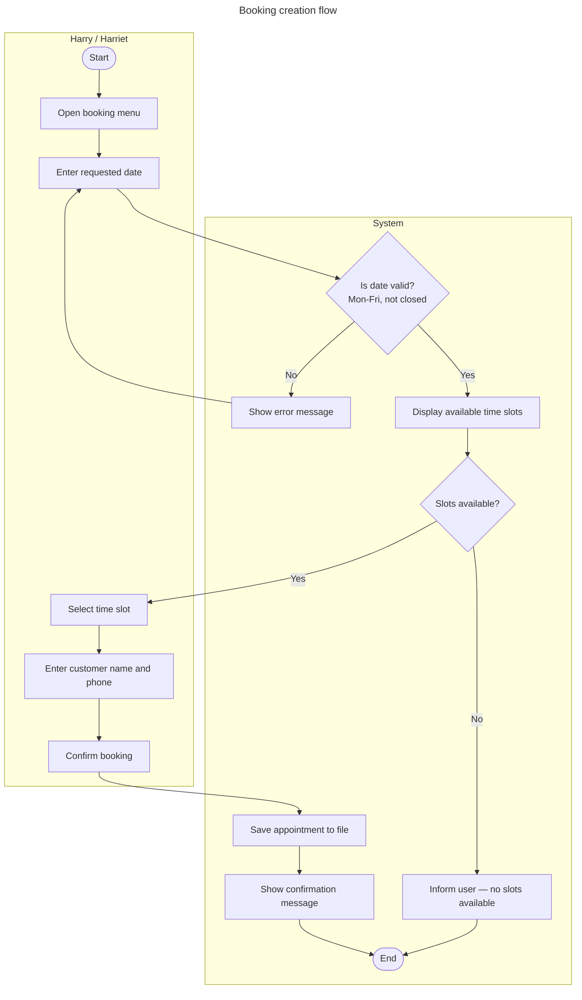

```mermaid
---

title: Booking creation flow

---

flowchart TD

    subgraph User["Harry / Harriet"]

        A([Start])

        B[Open booking menu]

        C[Enter requested date]

        I[Select time slot]

        J[Enter customer name and phone]

        K[Confirm booking]

    end

  
  

    subgraph System["System"]

        D{Is date valid?\nMon-Fri, not closed}

        E[Show error message]

        F[Display available time slots]

        G{Slots available?}

        H[Inform user — no slots available]

        L[Save appointment to file]

        M[Show confirmation message]

        Z([End])

    end

    A --> B --> C --> D

    D -- No --> E --> C

    D -- Yes --> F --> G

    G -- No --> H --> Z

    G -- Yes --> I --> J --> K --> L --> M --> Z
```
