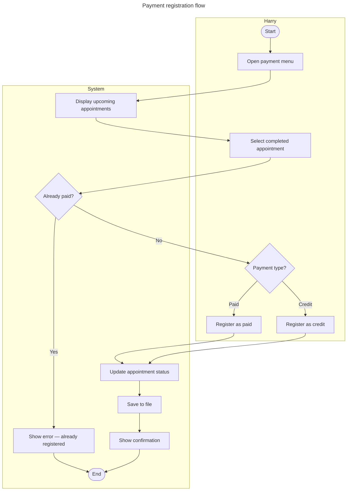

```mermaid
---

title: Payment registration flow

---

flowchart TD

    subgraph User["Harry"]

        A([Start])

        B[Open payment menu]

        D[Select completed appointment]

        G{Payment type?}

        H[Register as paid]

        I[Register as credit]

    end

  

    subgraph System["System"]

        C[Display upcoming appointments]

        E{Already paid?}

        F[Show error — already registered]

        J[Update appointment status]

        K[Save to file]

        L[Show confirmation]

        Z([End])

    end

  

    A --> B --> C --> D --> E

    E -- Yes --> F --> Z

    E -- No --> G

    G -- Paid --> H --> J

    G -- Credit --> I --> J

    J --> K --> L --> Z
```