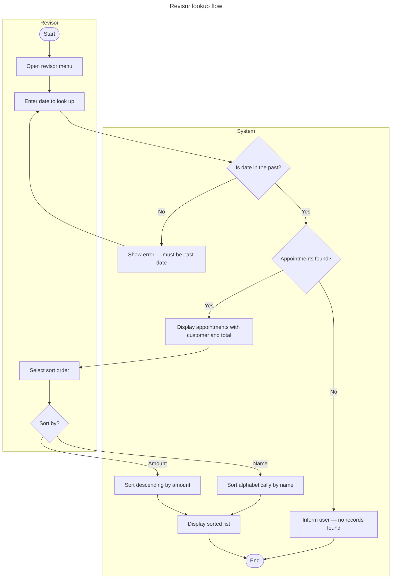

```mermaid
---

title: Revisor lookup flow

---

flowchart TD

    subgraph User["Revisor"]

        A([Start])

        B[Open revisor menu]

        C[Enter date to look up]

        I[Select sort order]

        J{Sort by?}

    end

  

    subgraph System["System"]

        D{Is date in the past?}

        E[Show error — must be past date]

        F{Appointments found?}

        G[Inform user — no records found]

        H[Display appointments with customer and total]

        K[Sort alphabetically by name]

        L[Sort descending by amount]

        M[Display sorted list]

        Z([End])

    end

  

    A --> B --> C --> D

    D -- No --> E --> C

    D -- Yes --> F

    F -- No --> G --> Z

    F -- Yes --> H --> I --> J

    J -- Name --> K --> M

    J -- Amount --> L --> M

    M --> Z
```