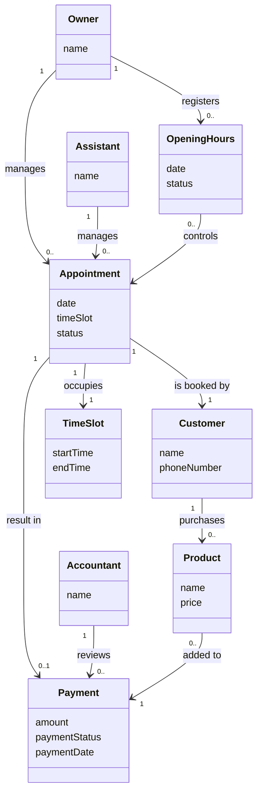

```mermaid
classDiagram

    class Appointment {

        date

        timeSlot

        status

    }

    class Customer {

        name

        phoneNumber

    }

  

    class Payment {

        amount

        paymentStatus

        paymentDate

    }

  

    class TimeSlot {

        startTime

        endTime

    }

  

    class Owner {

        name

    }

  

    class Assistant {

        name

    }

  

    class Accountant{

        name

    }

  

    class Product {

        name

        price

    }

  

    class OpeningHours {

        date

        status

    }

  

Appointment "1" --> "1" Customer : is booked by

Appointment "1" --> "0..1" Payment: result in

Appointment "1" --> "1" TimeSlot : occupies

Owner "1" --> "0.." Appointment : manages

Assistant "1" --> "0.." Appointment : manages

Accountant "1" --> "0.." Payment : reviews

Owner "1" --> "0.." OpeningHours : registers

Customer "1" --> "0.." Product : purchases

Product "0.." --> "1" Payment : added to

OpeningHours "0.." --> Appointment : controls
```